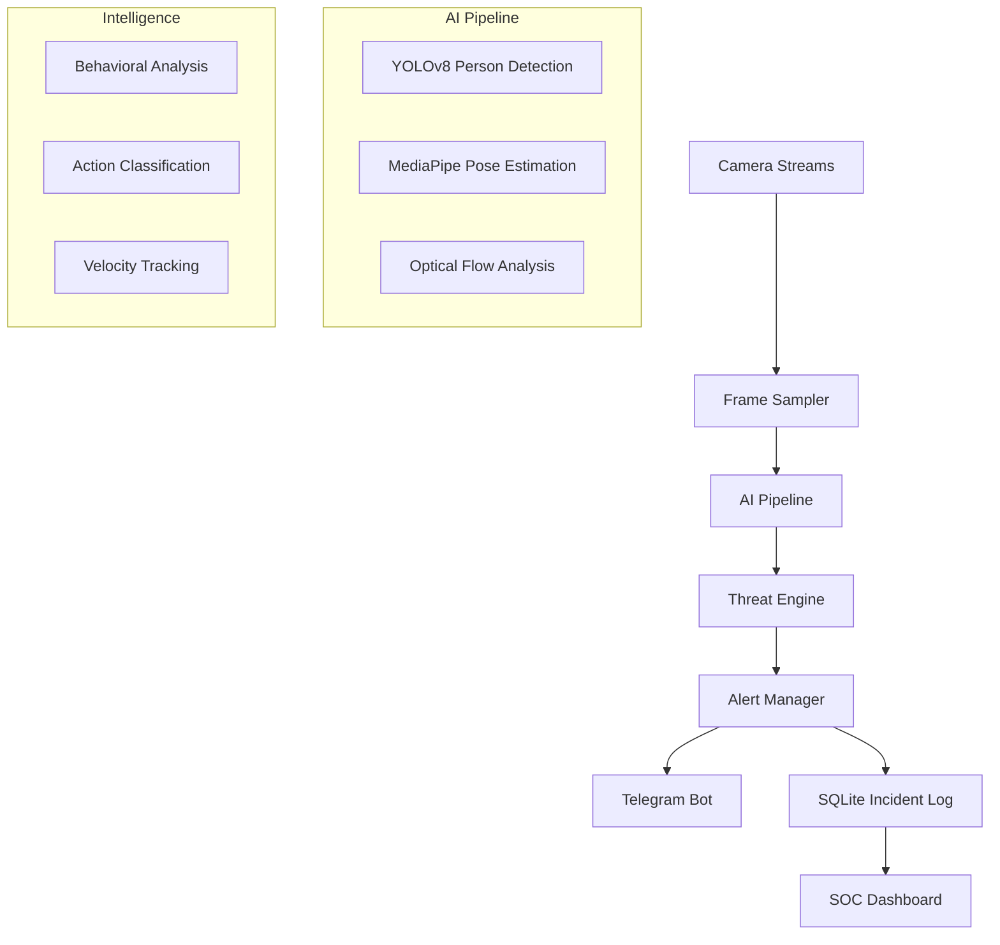

# SafeWatch — AI-Powered CCTV Threat Detection System

SafeWatch is an **enterprise-grade surveillance intelligence platform** designed for real-time detection of complex human behaviors and physical threats. Engineered for high-performance CPU inference, SafeWatch integrates YOLOv8, MediaPipe, and custom kinetic analytics into a modular, event-driven ecosystem.

## 🚀 Key Capabilities

- **Behavioral Intelligence**: Real-time analysis of human posture, joint angles, and strike velocities.
- **Advanced Threat Detection**:
  - **Fights & Assaults**: Detects aggressive proximity, raised arms, and strike patterns.
  - **Falls & Unconsciousness**: State-machine tracking for hip-drop impact and post-fall stillness.
  - **Harassment & Abuse**: Analyzes sustained asymmetric proximity and aggressive gesturing.
  - **Crowd Dynamics**: Monitors optical flow divergence for panic and accident detection.
  - **Trespassing**: High-precision polygon zone monitoring with dwell-time analytics.
- **Enterprise Alerting**: Async Telegram integration with annotated snapshots and agent routing.
- **SOC Dashboard**: Dark-themed Streamlit monitoring center with live feeds and incident analytics.
- **Edge Optimized**: Specifically tuned for CPU inference using ONNX Runtime and smart frame sampling.

## 🏗️ System Architecture



## 🛠️ Technology Stack

- **Computer Vision**: OpenCV, Ultralytics YOLOv8, MediaPipe
- **AI Inference**: ONNX Runtime, PyTorch
- **Backend**: Python 3.10+, Asyncio, Loguru
- **Database**: SQLite3 (Thread-safe)
- **UI/UX**: Streamlit (Dark SOC Theme)
- **Communications**: Python-Telegram-Bot v20+

## 📥 Installation

1. **Clone the Repository**:
   ```bash
   git clone https://github.com/abarnesh01/safewatch.git
   cd safewatch
   ```

2. **Install Dependencies**:
   ```bash
   pip install -r requirements.txt
   ```

3. **Environment Setup**:
   Copy `.env.example` to `.env` and configure your Telegram Bot Token and Chat ID.
   ```bash
   cp .env.example .env
   ```

## 🚀 Deployment

### 1. Surveillance Engine
Launch the core processing pipeline:
```bash
python main.py
```

### 2. SOC Dashboard
Launch the web-based monitoring interface:
```bash
streamlit run dashboard/app.py
```

### 3. Training Pipeline
To retrain the action classifier or fine-tune YOLO:
```bash
python training/dataset_prep.py
python training/train_classifier.py
python training/export_onnx.py
```

## 🛡️ Engineering Standards

- **Zero Placeholders**: Every module is fully implemented for production use.
- **Defensive Programming**: Robust exception handling and automatic stream recovery.
- **Thread Safety**: Multithreaded capture and analysis with synchronized logging.
- **Scalability**: Modular detector design allows adding new threat models seamlessly.

## 🔄 Safe Git Synchronization Workflow

To support continuous enterprise development and high-frequency commit cycles, follow the **SAFE** synchronization loop:

1. **Clean Workspace**: Ensure your working tree is clean.
2. **Isolated Commit**: Make small, meaningful production improvements.
   ```bash
   git add -A
   git commit -m "feat: isolated subsystem update"
   ```
3. **Rebase Sync**: Synchronize with the remote branch using rebase to maintain linear history.
   ```bash
   git fetch origin
   git rebase origin/Prasanth
   ```
4. **Immediate Push**: Push changes immediately after synchronization.
   ```bash
   git push origin Prasanth
   ```

> [!CAUTION]
> NEVER use `git pull` without `--rebase` on active development branches. ALWAYS ensure your tree is clean before rebasing.

## 📄 License
Enterprise Proprietary - © 2026 SafeWatch AI Global Systems.
